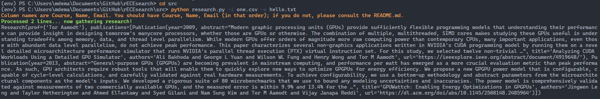

# rECEsearch

A simple Python project to grab Google Scholar data for research at UBC.

## Requirements

- Python
- scholarly (in lieu of a Google Scholar API)
- Data, in the form a csv file

Example CSV data:

```csv
Course,       Name,                   Email
CPEN211.101,  Tor Aamodt,             aamodt@ece.ubc.ca
CPEN221.101,  Sathish Gopalakrishnan, sathish@ece.ubc.ca
```

Virtual environment quickstart (for Windows):

```bash
pip install virtualenv
virtualenv env
source ./env/Scripts/active
pip install -r requirements.txt
pip freeze > requirements.txt
```

## Usage

Run `python research.py -i <input file> -o <output file>`, where 'input file' is the name of a CSV file containing professor names. See `research.py` for more information on the anticipated structure of the CSV data.

### Example



## Future

Collect research from more sources, export to RSS feed.
