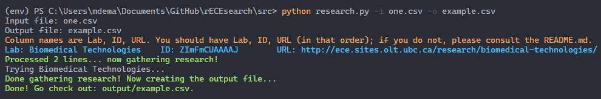
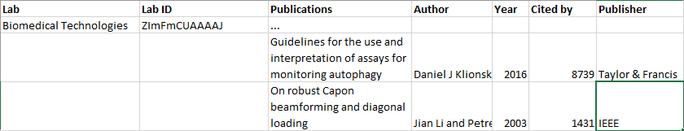

# rECEsearch

A simple Python project to grab Google Scholar data for research at UBC.

[](https://www.python.org/) 

[](https://lbesson.mit-license.org/)

## Requirements

- Python
- scholarly (in lieu of a Google Scholar API)
- Data, in the form a csv file

Example CSV data:

```csv
Lab,                      ID,           URL
Biomedical Technologies,  ZImFmCUAAAAJ, http://ece.sites.olt.ubc.ca/research/biomedical-technologies/
Communication Systems,    PhdzKFcAAAAJ, http://ece.sites.olt.ubc.ca/research/communication-systems/
```

(Do not include the spaces if you choose to use this data.)

Virtual environment quickstart (for Windows):

```bash
pip install virtualenv
virtualenv env
source ./env/Scripts/activate
pip install -r requirements.txt
pip freeze > requirements.txt
```

### N.B.: As of July 10th, 2020 you should manually tweak the scholarly package to get the desired output from research.py

There's an open issue for this, but for now go to `env/Lib/scholarly/author.py` and change line 10 to read:

```python
_CITATIONAUTH = '/citations?hl=en&user={0}&sortby=pubdate'
```

The "sortby=pubdate" is what we're after here.

## Usage

Run `python research.py -i <input file> -o <output file>`, where 'input file' is the name of a CSV file containing professor names. See `research.py` for more information on the anticipated structure of the CSV data. In general, your input file should have three columns: lab, lab ID, and a URL (in that order).

- 'Lab' should be the name of the lab at UBC
- 'Lab ID' should be the Google Scholar ID. For example, if you navigate to [this](https://scholar.google.com/citations?user=EmD_lTEAAAAJ&hl=en) link you want the `user=...` part of the link, so in this case the ID is `EmD_lTEAAAAJ`.
- 'URL' should be the homepage this content is displayed on the UBC website. As of right now, this field is *not* utilized, so don't worry about it to much.
  
After executing the command, an output CSV file is produced.

- 'Lab' and 'Lab ID' are the same as above
- 'Publications' is a kind-of placeholder for an arbitrary amount of rows (like a file tree); the publication information is printed in the next N rows with the following (rather self-explanatory) headers:
  - 'Title'
  - 'Author'
  - 'Year'
  - 'Cited by' (the number of other publications that have cited the give publication)
  - 'Publisher'

### Example

Here's an example console call:



And then here would be the generated csv (converted to a Markdown table):

|Lab                    |Lab ID      |Publications|Title                                                                       |Author              |Year|Cited By|Publisher       |
|-----------------------|------------|------------|----------------------------------------------------------------------------|--------------------|----|--------|----------------|
|Biomedical Technologies|ZImFmCUAAAAJ|...         |                                                                            |                    |    |        |                |
|                       |            |            |Guidelines for the use and interpretation of assays for monitoring autophagy|Daniel J Klionsky an|2016|8739    |Taylor & Francis|
|                       |            |            |On robust Capon beamforming and diagonal loading                            |Jian Li and Petre St|2003|1431    |IEEE            |

Or, in Excel:



## Future

Collect research from more sources, export to RSS feed.
